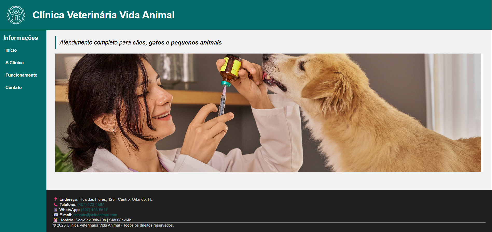

# Veterinary Clinic Website

Website developed to practice semantic HTML5 structure, CSS3 styling, responsive layouts, and Flexbox organization.

This project simulates an institutional veterinary clinic website with informational sections, service presentation, navigation, and a modern responsive layout.

---

## Preview



---

## Technologies Used

- HTML5
- CSS3
- Flexbox
- Responsive Design

---

## Features

- Semantic HTML structure
- Responsive layout
- Organized navigation
- Structured content sections
- Modern visual organization
- Clean file structure

---

## Project Structure

```bash
├── assets
│   ├── css
│   └── images
├── pages
├── index.html
└── README.md
```

---

## Learning Goals

This project was created to improve skills in:

- Semantic HTML
- Flexbox
- Responsive Design
- Layout structuring
- CSS organization
- Visual hierarchy

---

## Future Improvements

- Add JavaScript interactions
- Create functional forms
- Improve accessibility
- Add animations and transitions
- Deploy online

---

## Author

Developed by Larissa Gatto

GitHub:https://github.com/Larissangatto